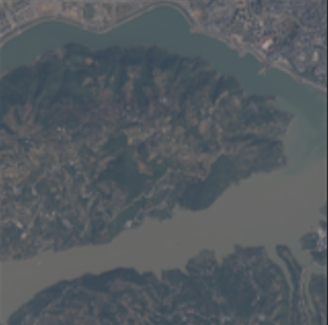
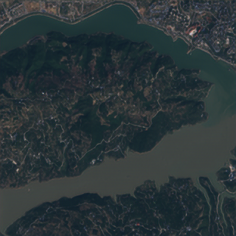
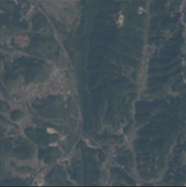
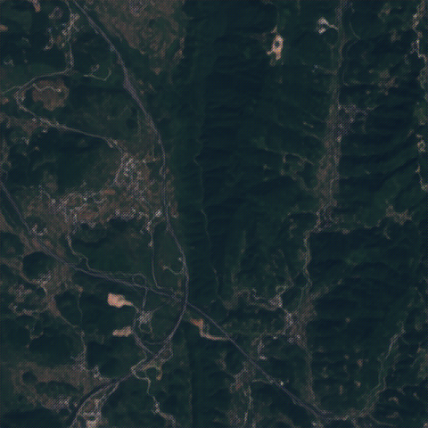

# Oli2MSI Super-Resolution with SRGAN

Welcome! This project is all about single-image super-resolution for satellite images, using a GAN-based approach (SRGAN) and the OLI2MSI dataset. If you're working with remote sensing data and want to boost the resolution of your imagery, you're in the right place.

## Dataset: OLI2MSI

You'll need the OLI2MSI dataset, which you can grab here: [Kaggle - OLI2MSI](https://www.kaggle.com/datasets/nexuswho/oli2msi)

After downloading, extract it so your folders look like this:

```
your_data_dir/
    train_lr/   # Low-res .TIF images
    train_hr/   # High-res .TIF images
    test_lr/    # (Optional) Test LR images
    test_hr/    # (Optional) Test HR images
```

## Getting Started

1. **Install the required Python packages:**

```bash
pip install tensorflow numpy scikit-learn rasterio tifffile pillow matplotlib scikit-image
```

2. (Optional) Use a virtual environment:

```bash
python -m venv venv
# On Windows:
venv\Scripts\activate
# On Linux/Mac:
source venv/bin/activate
```

## Project Components

This project includes several Python scripts, each with a specific function. Here's a breakdown of what each script does:

### 1. `train.py`

The main training script for the SRGAN model. It handles:

- Loading and preprocessing the OLI2MSI dataset
- Building the generator and discriminator models
- Training the models with perceptual loss, adversarial loss, and L1 loss
- Saving checkpoints and sample images during training
- Implementing early stopping and learning rate reduction

### 2. `test_srgan.py`

Testing and evaluation script that:

- Loads a trained generator model
- Processes low-resolution test images
- Generates super-resolution images
- Calculates PSNR and SSIM metrics
- Saves the generated images for comparison

### 3. `data.py`

Data loading and preprocessing utility that:

- Loads .TIF satellite images from OLI2MSI dataset
- Performs normalization and scaling
- Creates TensorFlow datasets for training and validation

### 4. `model/srgan.py`

Defines the architecture of the SRGAN models:

- Generator based on ResNet with skip connections
- Discriminator with convolutional layers
- VGG19-based feature extractor for perceptual loss
- Fixed input size of 160×160 for LR images and 480×480 for HR images

### 5. `model/common.py`

Common utilities for the model:

- Image normalization and denormalization
- Pixel shuffle implementation for upsampling
- PSNR calculation for evaluation

## Image Comparison

Below are examples of low-resolution (LR) and their corresponding super-resolution (SR) versions generated by our trained SRGAN model. The images demonstrate the 3× resolution enhancement achieved by the model.

### Example 1 - Side by Side Comparison

|                           Low Resolution (160×160)                            |                            Super Resolution (480×480)                            |
| :---------------------------------------------------------------------------: | :------------------------------------------------------------------------------: |
|  |  |

### Example 2 - Side by Side Comparison

|                           Low Resolution (160×160)                            |                            Super Resolution (480×480)                            |
| :---------------------------------------------------------------------------: | :------------------------------------------------------------------------------: |
|  |  |

The SRGAN model successfully enhances the spatial details while preserving the natural colors and textures of the satellite imagery. Notice how the super-resolved images reveal finer structures and sharper boundaries that were not visible in the low-resolution inputs.

## Training the Model

To train the SRGAN model on your OLI2MSI data, run:

```bash
python train.py -d <path_to_data_dir> -o <output_dir>
```

You can tweak various parameters to optimize training. Here's a more detailed example:

```bash
python train.py -d ./oli2msi -o ./output -b 8 --val_split 0.15 --epochs 100 --g_lr 1e-4 --d_lr 1e-4 --patience 15 --log_freq 50 --save_freq 5
```

### Training Parameters:

- `-d` or `--datadir`: Where your train_lr/ and train_hr/ folders are
- `-o` or `--outputdir`: Where results/checkpoints will be saved
- `-b` or `--batch_size`: Batch size (default: 8)
- `--val_split`: Fraction of data for validation (default: 0.15)
- `--epochs`: Number of epochs (default: 100)
- `--g_lr`, `--d_lr`: Learning rates for generator/discriminator
- `--patience`: Early stopping patience
- `--log_freq`: Print training info every N steps
- `--save_freq`: Save sample images every N epochs

## Testing with Pre-trained Weights

This repository includes pre-trained weights in the `weights` folder. You can use these to generate super-resolution images without retraining:

```bash
python test_srgan.py --weights weights/final_generator_weights.h5 --lr_dir <path_to_test_lr> --hr_dir <path_to_test_hr> --output_dir <output_dir>
```

### Important Notes:

- The model expects low-resolution images with a fixed size of 160×160 pixels
- The output will be super-resolved to 480×480 pixels (3× upscaling)
- Weights are provided in the `weights/final_generator_weights.h5` file

## Testing / Evaluation

Once you've trained a model or if you're using the provided weights, you can test it like this:

```bash
python test_srgan.py --weights <generator_weights.h5> --lr_dir <path_to_test_lr> --hr_dir <path_to_test_hr> --output_dir <output_dir>
```

- `--weights`: Path to your trained generator weights (.h5 file)
- `--lr_dir`: Folder with LR test images
- `--hr_dir`: Folder with HR test images
- `--output_dir`: Where to save results

The script will:

1. Load your trained model
2. Process each LR image
3. Generate the SR version
4. Calculate PSNR and SSIM metrics
5. Save the output images

## Tips & Notes

- All images should be in `.TIF` format for training and testing
- The code is tailored for OLI2MSI satellite data, but you can adapt it for similar datasets
- The model works with a fixed input size of 160×160 pixels for LR images
- For best results, ensure your GPU has sufficient memory for the batch size you choose
- Adjust the learning rates if you encounter training instability

---

If you use this code or the OLI2MSI dataset, please give credit to the dataset authors and this repo. Questions or suggestions? Feel free to open an issue or contribute!
